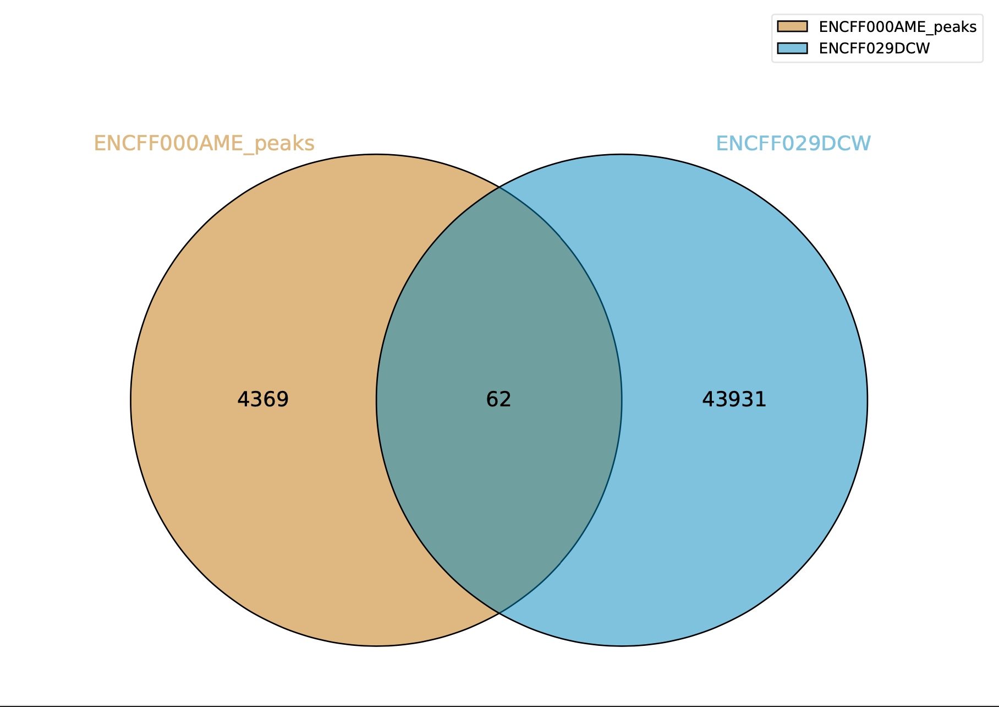
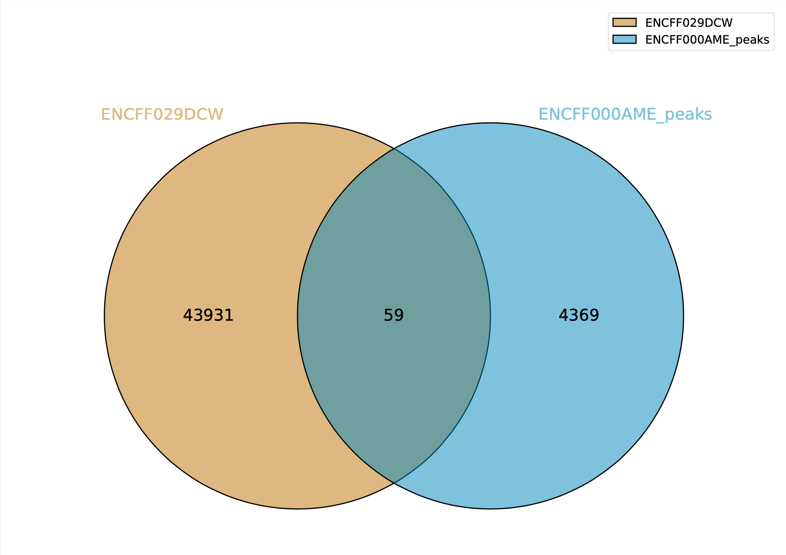

# hse_hw2_chip
## [COLAB](https://colab.research.google.com/drive/1r0SpdWy2rRUAvcUUR-JmzZJk9E0SLaj3?usp=sharing)

## 1. Чтения
| ENCFF000AME (реплика 1) | ENCFF000AMF (реплика 2) | ENCFF000AHM (контроль) |
| :-------------: |:------------------:| :-----:|
|     |    | практически то же самое, но анализ неподрезанного контроля не сохранился( |

Можно заметить, что качество не очень хорошее (на многих позициях "усы" выходят из зеленой зоны), поэтому я решила произвести подрезание.Я использовала библиотеку `trimmomatic`. Для параметра ILLUMINACLIP  качестве файла с адаптерами я использовала предложенный в исходном колабе, остальные параметры были установлены 2:35:15. (Остальные параметры для команды `LEADING:5 TRAILING:5 SLIDINGWINDOW:4:10 MINLEN:36`)

### Новые результаты
| ENCFF000AME (реплика 1) | ENCFF000AMF (реплика 2) | ENCFF000AHM (контроль) |
| :-------------: |:------------------:| :-----:|
|     |    |  |
|     |    |  |
|     |    |  |
|     |    |  |

После подрезания качество улучшилось, но качество 2-й реплики имеет самый низкий уровень.

## 2. Выравниевание на хромосому
| образец | всего ридов | выровненных уникально | выровненных не уникально (>1) | невыровненных |
| :-------------: |:------------------:| :-----:| :-----:| :-----:|
| **ENCFF000AME (реплика 1)** | 35215386 | 1600829 (4.55%) | 4549354 (12.92%) | 29065203 (82.54%) |
| **ENCFF000AMF (реплика 2)**  | 20324895 | 843824 (4.15%) | 3002624 (14.77%) | 16478447 (81.08%) |
| **ENCFF000AHM (контроль)**| 37806788 | 1753707 (4.64%) | 4999759 (13.22%) | 31053322 (82.14%) |

Малое количество выровненных ридов (~4.5%) и большое количество невыровненных (~82%) связано с тем, что выравнивание производилось всего на одну хромосому (из 23 пар).
## 3. Диграмма Венна

| ENCFF000AME (реплика 1) vs. ENCODE | ENCODE vs. ENCFF000AME (реплика 1) | 
| :-------------: |:------------------:|
|  |  | 

Пересечений очень мало. Это связано с тем, что я производила выравнивание только на chr(14), а проект ENCODE на все хоромосомы. (Разное количество пересечений обусловлено алгоритмом поиска пересечений - если пик попадает на два других пика, это считается одним пересечением, а не двумя.)

| ENCFF000AMF (реплика 1) vs. ENCODE | ENCODE vs. ENCFF000AMF (реплика 1) | 
| :-------------: |:------------------:|
|  |  | 

 Ситуация аналогична 1й реплике.
